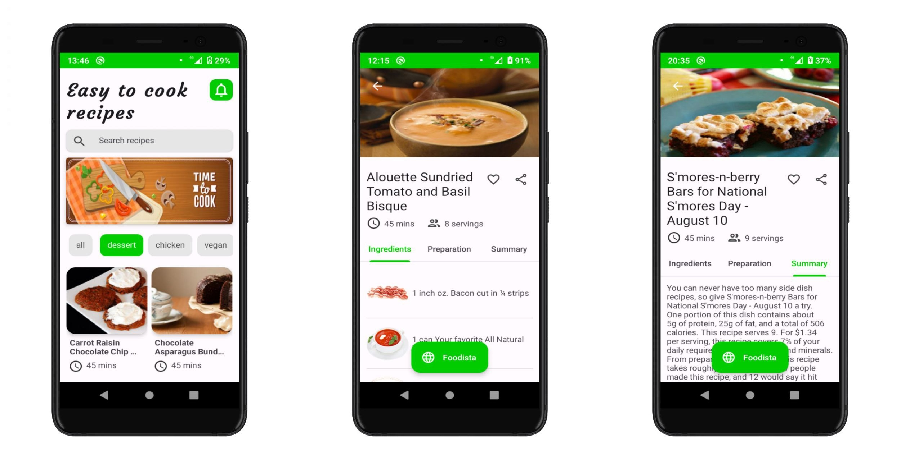
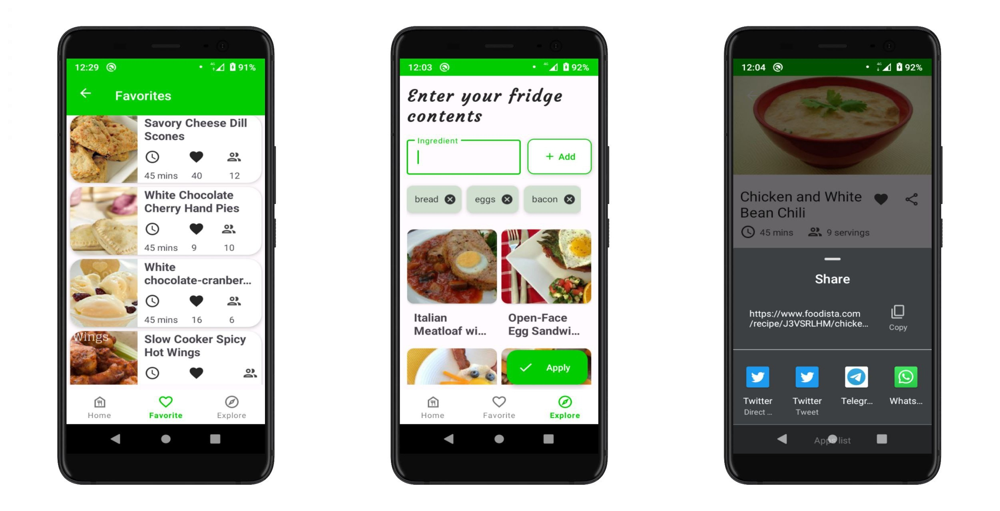

# CookIt
An MVVM clean architecture app that displays various food recipes from the [Spoonacular API](https://spoonacular.com/food-api)

## Features
   * Browse various categories of recipes.
   * Search for a specific recipe by name, cuisine, or ingredients.
   * View recipe details such as ingredients, instructions, nutrition information, and more.
   * Save your favorite recipes to your personal collection.
   * View your favorite recipes offline.
   * Share recipes with friends and family.
## Architecture
This app follows the Clean MVVM architecture, which separates the app into three layers:
  * Presentation layer: Contains the UI, ViewModels, and Navigation components.
  * Domain layer: Contains the business logic and UseCases.
  * Data layer: Contains the repositories, data sources, and the Room database.

## Screenshots



## Setup
To get started with the app, you'll need to obtain an API key from [Spoonacular API](https://spoonacular.com/food-api)
   1. Clone the repository or download the ZIP file.
   2. Import the project into Android Studio.
   3. In the local.properties file, add your Spoonacular API key in the following format:
      ```
      API_KEY="YOUR_API_KEY"
      ```
   4. Open your .gitignore file and add the gradle.properties file so that it will not be included in the git repository, therefore not visible by others.
      ```
      gradle.properties
      ```
   5. In your app-level build.gradle file, add the following line in the buidConfig block.
      ```
      buildConfig{
      ...
      buildConfigField("String", "API_KEY", API_KEY)
      }
      ```
   6. Finaly, you can access the key from anywhere in your app.
      ```
      BuildConfig.API_KEY
      ```

## Techstacks
The app is built using popular libraries including:
   * [Room](https://developer.android.com/topic/libraries/architecture/room) A part of the Android Jetpack and a persistence library that provides an abstract layer over SQLite to allow for more robust database access while harnessing the full power of SQLite.
   * [Navigation Component](https://developer.android.com/guide/navigation) A part of Android Jetpack and a UI toolkit for navigating between screens within an app. It provides a simple, consistent and flexible way to manage navigation in the app.
   * [Retrofit](https://square.github.io/retrofit/) A popular networking library for Android that makes it easy to consume RESTful APIs.
   * [Kotlin Coroutines](https://kotlinlang.org/docs/reference/coroutines-overview.html)  Coroutines are a Kotlin feature that makes it easier to write asynchronous, non-blocking code.
   * [Hilt](https://dagger.dev/hilt/) Hilt is a dependency injection library for Android that provides a standard way to manage dependencies in an Android app.
   * [Glide](https://bumptech.github.io/glide/) Glide is a popular image loading library for Android that makes it easy to load and display images in the app.
   * [ViewModel](https://developer.android.com/topic/libraries/architecture/viewmodel) The ViewModel library is part of the Android Jetpack and a UI component that is responsible for preparing and managing the data for an Activity or a Fragment.
   * [liveData](https://developer.android.com/topic/libraries/architecture/livedata) LiveData is a data holder class that can be observed by UI components, such as activities and fragments.
   * [Flows](https://kotlin.github.io/kotlinx.coroutines/kotlinx-coroutines-core/kotlinx.coroutines.flow/) A library that provides a way to represent and manage streams of data in Kotlin.
   * [Coroutines](https://kotlinlang.org/docs/coroutines-overview.html) A lightweight concurrency framework for Kotlin. 
   * [Truth](https://truth.dev/) A testing library for Java and Kotlin that provides fluent assertion APIs for unit tests.
   
## Contributions
We welcome contributions to this project. If you have any suggestions or want to report a bug, please open an issue or submit a pull request.
